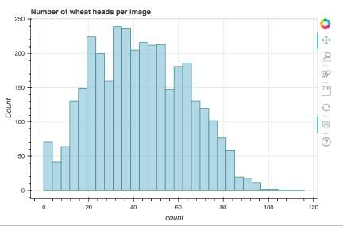
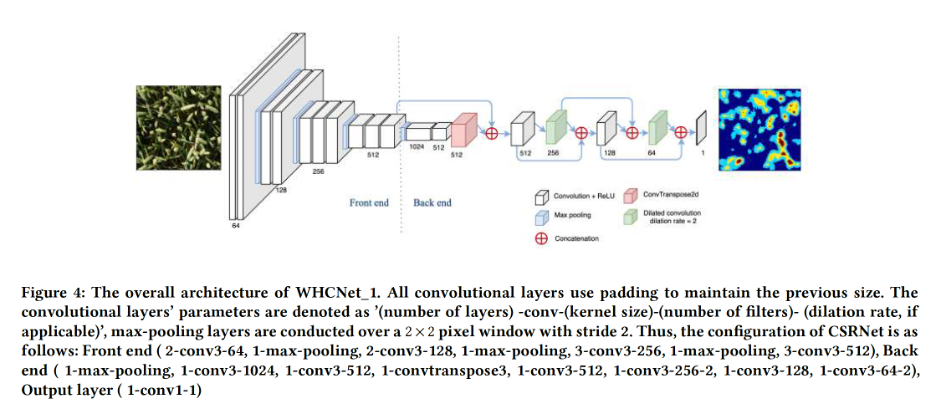
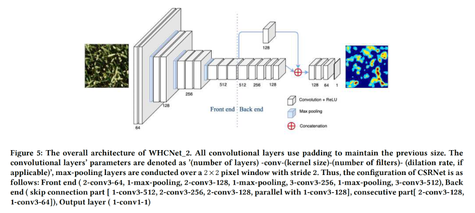
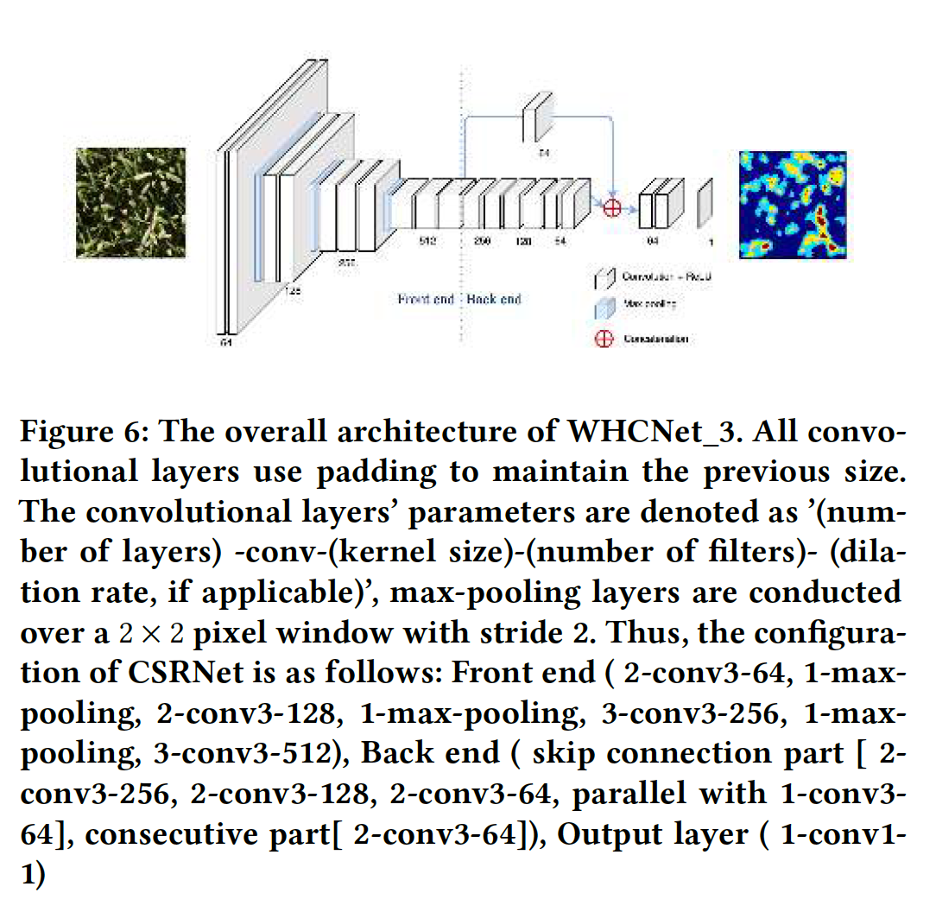
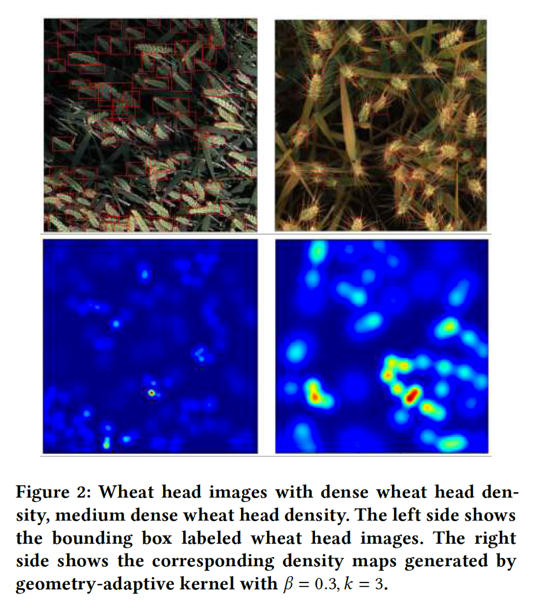
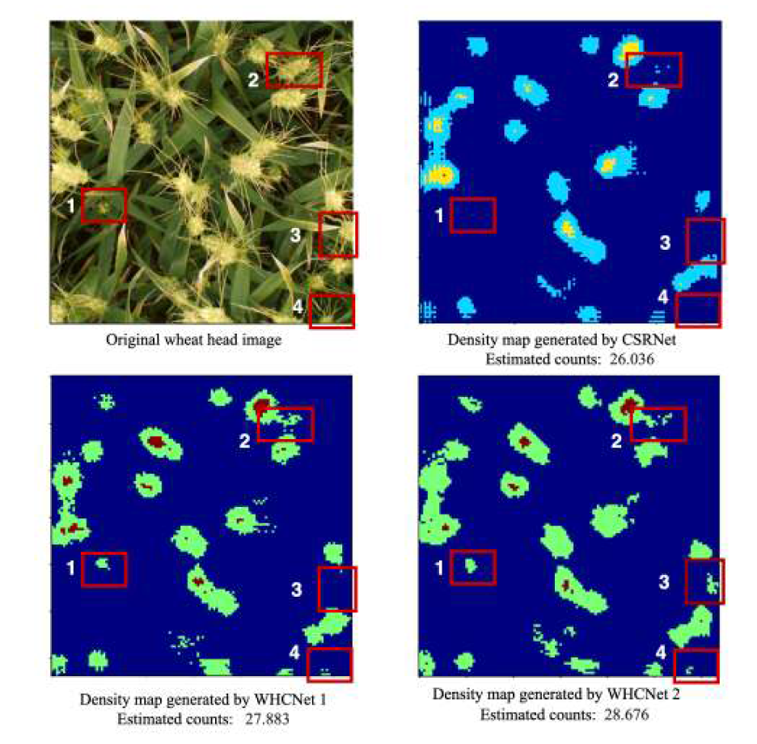
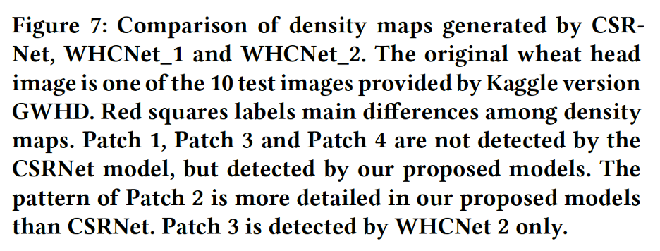
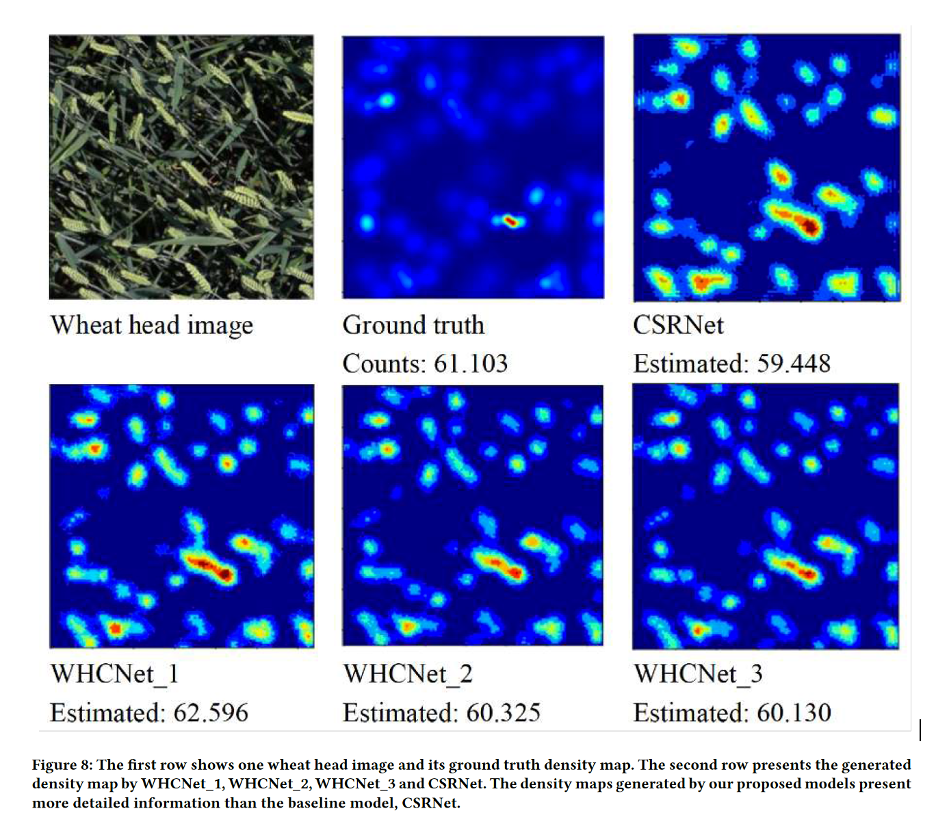

# Wheat-head-counting-from-images--Object-counting
Wheat is one of the most significant crop species with an annual worldwide grain production of 700
million tonnes. Assessing the production of wheat spikes can help us measure the grain production. Thus, detecting and characterizing spikes from images of wheat fields is an essential component in a wheat breeding process. 

In this study, we propose three wheat head counting networks (WHCNet\_1, WHCNet\_2 and WHCNet\_3) to accurately estimate the wheat head count from an individual image and construct high quality density map, which illustrates the distribution of wheat heads in the image. The WHCNets are composed
of two major components: a convolutional neural network (CNN) as the front-end for wheat head image feature extraction and a CNN with skip connections for the back-end to generate high-quality density maps. The dataset used in this study is the Global Wheat Head Detection (GWHD) dataset, which is a large, diverse, and well-labelled dataset of wheat images and built by a joint international collaborative effort. We compare our methods with CSRNet, a deep learning
method which developed for highly congested scenes understanding and 
performing accurate count estimation as well as presenting high
quality density maps. By taking the advantage of the skip connections between CNN layers, WHCNets integrate features  from low CNN layers to high CNN layers, 
thus, the output density maps have both high spatial resolution and detailed representations of the input images. 
The experiments showed that our methods outperformed CSRNet in terms of  the evaluation metrics, mean  absolute  error  (MAE)  and  the  root  mean squared  error  (RMSE) with smaller model sizes. 

# Method
Density map based wheat head counting refers to the input is a wheat head image and the output is the density map of the wheat heads, which shows how many wheat heads per unit area and the spatial distribution of wheat heads in that image, so it is very useful in many applications, such as, estimating the grain yield potential. Consequently, the number of wheat heads in an image can be obtained by the integration of its density map.

In this section, firstly, we will introduce the dataset and data preprocessing, then, we will discuss how to generate the ground truth density maps from wheat head images. For comparison purpose, we introduce a baseline network, CSRNet, which has achieved the state-of-the art performance on dense crowd counting tasks and vehicle counting tasks. Consequently, we present three wheat head counting networks, WHCNet\_1, WHCNet\_2 and WHCNet\_3, which can learn density maps from input wheat head images via fully CNNs. The loss function and evaluation metrics will be described as well.

## Dataset and data preprocessing
Global wheat head detection (GWHD) dataset\cite{wheat1} is collected from several countries around the world at different growth stages with a wide range of genotypes aiming at developing and benchmarking methods for wheat head detection. In terms of phenotyping datasets for object detection, 
GWHD dataset is currently the largest open labelled dataset
freely available for object detection for field plant phenotyping. 

In this study, we downloaded the GWHD dataset from https://www.kaggle.com/c/global-wheat-detection, which contains 3422 high-resolution RGB images for training and 10 high-resolution RGB images for testing, with 147793 wheat head with bounding boxes annotated which average
40 heads per image. 
Figure \ref{fig:count} shows the distribution of the count number of bounding boxes per image. As can be seen from the figure, most of the images have 20-60 wheat heads, and few images, specifically 4 images, contain more than 100 heads with a maximum of 116 heads. Moreover, there are 49 images containing no heads in the dataset. 

As deep learning framework requires a large amount of training data.
We crop four patches from four angles of each image with 1/4 size of the original image. Then, we vertical flip the patches to further double the wheat head image dataset, thus increase the size of our training set by a factor of 8. 
We have mentioned that in the GWHD dataset (kaggle version), there are 
3422 images in the training folder and 10 images in testing folder. We only augmented the images of the training folder and split these patches into training set, validation set and testing set. For the 10 images in the testing folder, as there are no annotation information given, we leave them out and use them to verify the performance of our models. 
Since the GWHD dataset has sub-datasets from different regions in the world, we shuffle these augmented image patches to ensure the images from different regions distributed in our training set, validation set and testing set, evenly. As a result, we 
 selecte 12,000 patches for training, 1,600 patches for validation set and 1,600 patches as the testing set. 

## Ground truth density map generation
The wheat head counting solution requires a set of annotated wheat head images, where all the wheat heads are marked by dots. The ground truth density map $D_{I}$
, for a wheat head image $I$, is defined as a sum of Gaussian functions centered on each dot annotation,
```math
D_{I}(p)=\sum_{\mu \in A_{I}}N(p;\mu ,\sigma )$
```
where $A_{I}$ is the set of 2D points annotated for the image $I$, and $N(p;\mu ,\sigma^{2} )$ represents the evaluation of a normalized 2D Gaussian function, with mean $\mu$ and isotropic co-variance matrix $\sigma^{2}$, evaluated at pixel position defined by $p$. With the density map $D_{I}$, the total wheat head count $N_{I}$ can be directly obtained by integrating the density map values in $D_{I}$ over the entire wheat head image, as follows,
```math
N_{I}=\sum_{p\in I}D_{I}(p).$
```
Since all the Gaussian are summed, so the total wheat head count is preserved even when there is overlap between wheat heads. The purpose of our wheat head counting model is to learn a mapping from the input wheat head image to a wheat head density map. 

However, in this definition of density function, each object is looked as independent samples in the image, thus, the perspective distortion, and
the pixels associated with different samples correspond
to areas of different sizes in the scene are all neglected. The  geometry-adaptive kernels\cite{MCCNN} takes the distortion caused by the homography
between the ground plane and the image plane into account by assuming around each object, the objects are 
evenly distributed, then the average distance between
this object and its nearest $k$ neighbors (in the image) gives a
reasonable estimate of the geometric distortion (caused by
the perspective effect). Therefore, for the
density maps of those dense scenes, the spread parameter $\sigma$ for each object can be determined 
based on its average distance to its neighbors, fromalized by
```math
     \sigma _{i}=\beta \bar{d_{i}}
    \label{eq:geo}
```

where $\bar{d_{i}}$ represents the average distance of $k$ nearest neighbors of the $i$th object. Thus, the Gaussian kernel with variance $\sigma _{i}$ is proportional to $\bar{d_{i}}$, and $\beta$ is a regulating parameter.

In this study, we adopt the geometry-adaptive kernels to generate the ground truth of wheat head images because most of the wheat heads are densely distributed in our images, similar as the dense crowd scene in the study of \cite{Li_2018}. As the GWHD dataset has provided the bounding box annotations, firstly, the dot-annotation can be obtained through calculating the centroid of each bounding box, then, the ground truth density maps for all wheat head images are generated. 
Figure \ref{fig:density} shows the bounding box labeled wheat head images, and their corresponding density maps generated using  the centroids of bounding boxes. The $\beta$ is set as 0.3, and $k$ is set as 3, followed the configuration in paper \cite{Li_2018}, as the wheat heads image is a dense image, similar with the context of crowds counting problem\cite{Li_2018}.


#










<a href="/pdfs/paper.pdf" class="image fit">read this paper</a>
